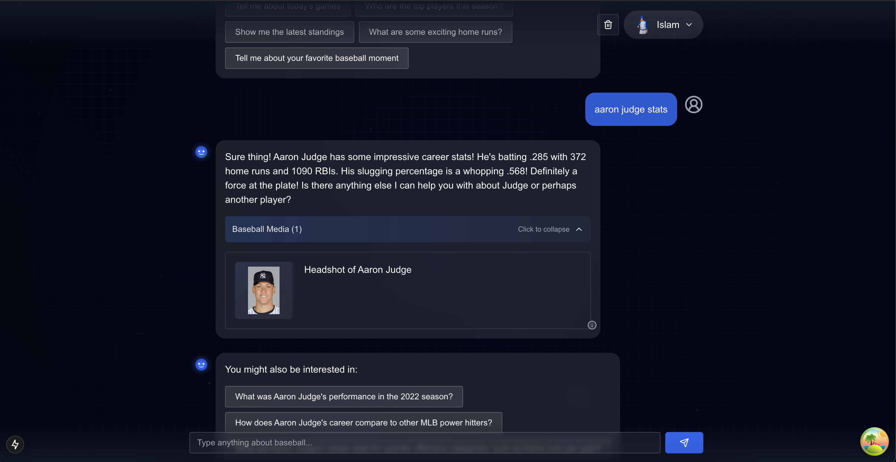
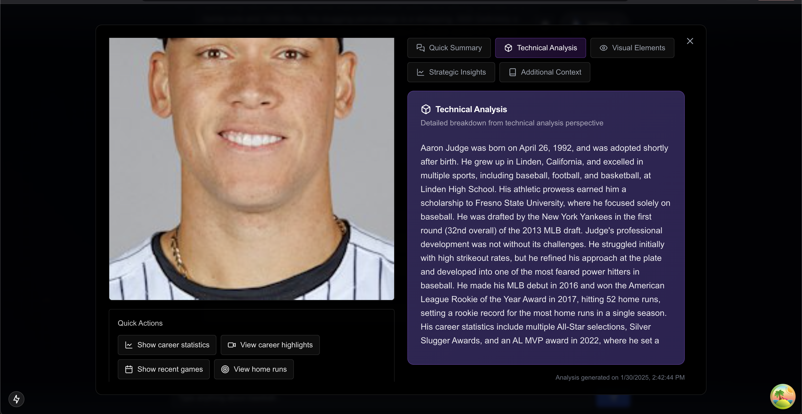
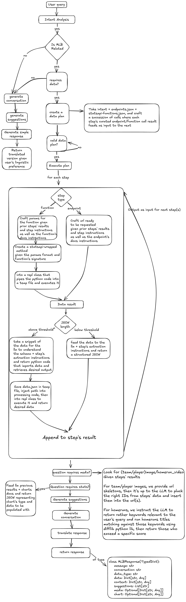

# BallTales - AI-Powered Baseball Analytics

> Built for the Google Cloud x MLB™ Hackathon 2025 - Challenge 2: Personalized Fan Highlights

An intelligent baseball analytics platform that leverages Google's Gemini API to deliver personalized MLB insights, multilingual support, and interactive media experiences.





## 🏆 Project Highlights

- **Intelligent Planning**: Leverages Gemini's advanced planning capabilities to orchestrate complex data retrieval and analysis strategies, automatically determining optimal execution paths
- **Dynamic Code Generation**: Uses Gemini to generate and execute Python code in real-time for data retrieval, processing, and extraction, enabling flexible and powerful data operations
- **Robust Error Handling**: Multi-model fallback system with retry mechanism and exponential backoff to handle rate limits and ensure reliable performance
- **Multilingual Support**: Full support for English, Spanish, and Japanese baseball content
- **Personalized Experience**: Custom fan preferences and tailored baseball insights with intelligent updates
- **Interactive Media**: Rich video integration with home run highlights and analysis
- **Real-time Analytics**: Live statistics and dynamic visualizations
- **Adaptive User Profiling**: Automatic preference updates based on conversation analysis and user interactions

## 🧠 Advanced AI Architecture

### Intelligent Agent Design
The application transcends traditional MLB Stats API implementations through a sophisticated agent architecture:



### Robust Gemini Integration

```python
class GeminiSolid:
    def __init__(self):
        # Model hierarchy from fastest/smallest to most capable
        self.model_hierarchy = [
            "gemini-1.5-flash-8b",
            "gemini-1.5-flash",
            "gemini-2.0-flash-exp",
            "gemini-1.5-pro",
        ]

    @retry(
        stop=stop_after_attempt(4),
        wait=wait_exponential(multiplier=1, min=4, max=10),
        retry=lambda x: isinstance(x, Exception) and "429" in str(x),
    )
    async def generate_with_fallback(self, prompt: str, ...):
        # Sophisticated fallback mechanism...
```

### Dynamic Code Execution
Unlike traditional static API wrappers, our agent uses a Python REPL for dynamic code execution:

```python
class MLBPythonREPL:
    async def __call__(self, code: str) -> REPLResult:
        """Execute dynamic Python code with safety measures"""
        with tempfile.TemporaryDirectory() as temp_dir:
            # Secure code execution environment
            # Output and error capturing
            # Timeout handling
```

This architecture enables:
- Intelligent query understanding and planning
- Robust error handling with model fallback
- Dynamic code generation and execution
- Secure sandboxed environment
- Automatic retry on rate limits
- Continuous user preference adaptation

### Advanced AI Capabilities

1. **Robust Intent Analysis**
   - Multi-model Gemini pipeline with automatic fallback
   - Rate limit handling with exponential backoff
   - Comprehensive error recovery
   - Context-aware query understanding
   
2. **Dynamic Code Generation**
   - REPL-based execution environment
   - Sandboxed code evaluation
   - Real-time code generation
   - Secure timeout handling

3. **Data Planning**
   - Gemini-based structured data retrieval
   - Dynamic plan generation
   - Dependency optimization
   - Fallback strategies

4. **Media Analysis**
   - Smart media content matching
   - Home run highlight analysis
   - Statistical context extraction
   - Dynamic media recommendations

5. **Response Generation**
   - Natural language generation in multiple languages
   - Context-aware suggestions
   - Personalized insights
   - Engaging conversation flow

6. **Intelligent User Profiling**
   - Automatic preference updates every 3 interactions
   - Background analysis of conversation context
   - Dynamic adaptation to user interests
   - Multi-dimensional preference tracking

## 🛠️ Technical Stack

### Frontend
- **Framework**: Next.js 15 with App Router
- **UI**: Tailwind CSS + shadcn/ui
- **Authentication**: JWT-based Auth
- **State Management**: React Hooks + Context
- **Database**: Prisma with PostgreSQL

### Backend
- **API**: FastAPI
- **AI**: Google Gemini API
- **Data Processing**: Python with MLB Stats API
- **Media Handling**: Custom video/image analysis
- **User Profiling**: Intelligent background updates

## 🚀 Getting Started

### Prerequisites
- Node.js 18+
- Python 3.9+
- PostgreSQL
- Google Cloud Account with Gemini API access

### Environment Setup
```bash
# Frontend (.env)
DATABASE_URL=postgresql://...
NEXT_PUBLIC_API_URL=http://localhost:8000
JWT_SECRET=secret

# Backend (.env)
GEMINI_API_KEY=your_api_key
UPDATE_INTERVAL=3  # Number of interactions before preference update
```

### Installation

```bash
# Frontend
cd frontend
npm install
npm run dev

# Backend
cd backend
python -m venv venv
source venv/bin/activate  # Windows: .\venv\Scripts\activate
pip install -r requirements.txt
python src/main.py
```

## 📊 Features in Action

1. **Multilingual Chat**
   - Real-time baseball discussions in 3 languages
   - Natural language processing
   - Context-aware responses
   - Adaptive language preference detection

2. **Video Analysis**
   - Home run highlight detection
   - Statistical overlay
   - Player performance tracking
   - Personalized highlight selection

3. **Data Visualization**
   - Dynamic chart generation
   - Interactive statistics
   - Real-time updates
   - User-specific data views

4. **User Personalization**
   - Intelligent fan preference updates
   - Team/player following
   - Custom alerts
   - Conversation-based interest tracking

## 💻 Technical Implementation

### Gemini Agent Pipeline

1. **Query Processing**
   ```python
   # Intent analysis using Gemini
   result = await self.gemini.generate_with_fallback(
       prompt=self.intent_prompt,
       generation_config=genai.GenerationConfig(
           response_mime_type="application/json",
           response_schema=IntentAnalysis,
       )
   )
   ```

2. **Plan Generation**
   ```python
   # Data retrieval planning
   plan = await self.gemini.generate_with_fallback(
       prompt=self.plan_prompt,
       generation_config=genai.GenerationConfig(
           temperature=0.2,
           response_schema=response_schema,
       )
   )
   ```

3. **Media Resolution**
   ```python
   # Smart video content matching
   media_plan = await self._get_search_parameters(
       intent=self.intent,
       data=data
   )
   ```

4. **User Preference Analysis**
   ```python
   # Intelligent preference updates
    updated_prefs = await analyze_user_preferences(user_req)
   ```

## 📝 License

This project is licensed under the Apache-2.0 License - see the [LICENSE](LICENSE) file for details.

## 🙏 Acknowledgments

- Google Cloud & MLB™ for the Hackathon opportunity
- MLB Stats API for data access

## 👨‍💻 Author

Built with ⚾️ by Islam HACHIMI (MR-GREEN1337)

---

> This project was created for the Google Cloud x MLB™ Hackathon 2025
